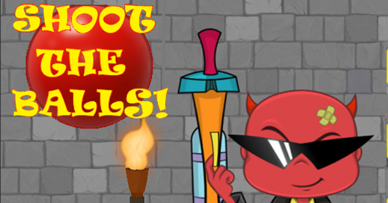

# Shoot the balls

To watch the preview with background music  go  [to this link](https://www.youtube.com/watch?v=eADbIcepP3Y)

---





# To Play:

##  Way -1 :  Run from command line

> Command line compiling:
> -----------------------
>
> ```
> g++ -IOpenGL\include -w -c "shoot the ball.cpp" -o Demo.o
> ```
>
> 
>
> Command line linking:
> ---------------------
>
> ```
> g++ -LOpenGL\lib Demo.o -o Demo.exe -lGlaux -lGLU32 -lglui32 -lglut32 -lOPENGL32 -lgdi32 -lwinmm
> ```
>
> Command line running:
> ---------------------
>
> Make sure **glut32.dll** is present in the same folder and run **Demo.exe**
>
## Way - 2: Download the the project
>#### Step 1: Clone the project
>
>```
>git clone https://github.com/Hmasum18/Shoot-the-balls.git
>```
>
>
>#### Step 2: After unzipping the project , go click the folder 'IGraphics-master'
>
>
>#### Step 3: Finally in the 'IGraphics-master' folder click 'shoot the balls.exe' file
>
>
>#### Step 3: Follow the instructions to play the game


---

# Preview

## Instructions:


---

## Mission Hogwarts(level 1):


---

## Mission Pirates of the Caribbean(level 2):


---

## Mission Impossible(level 3):


---

## Additional Features :


---

## Full Game preview :

